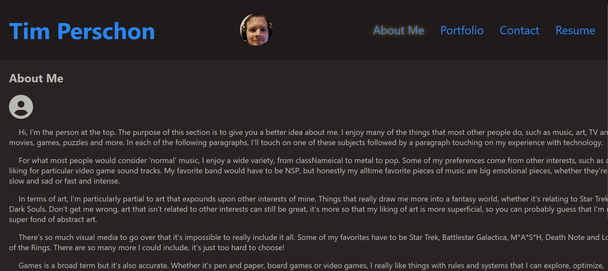
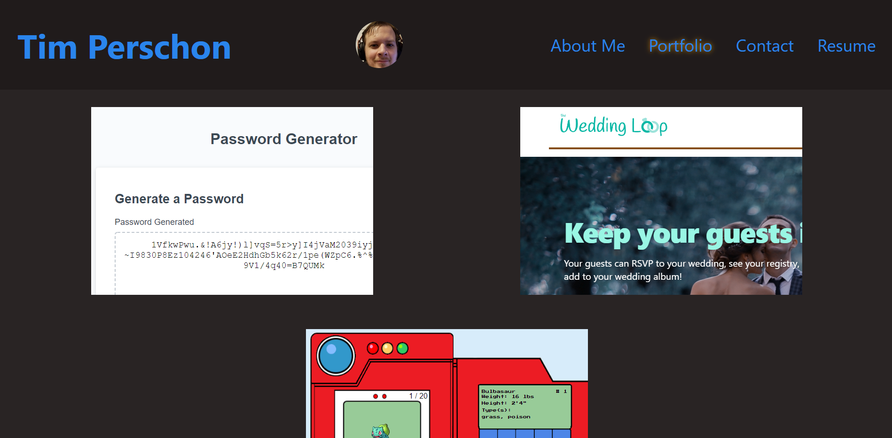
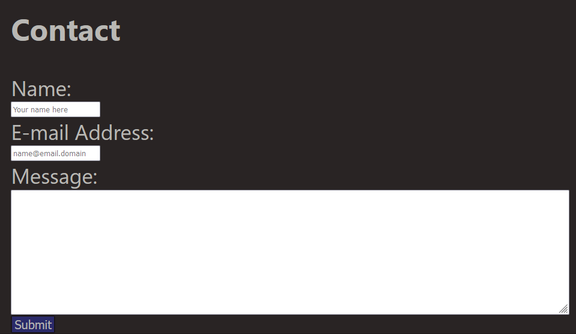
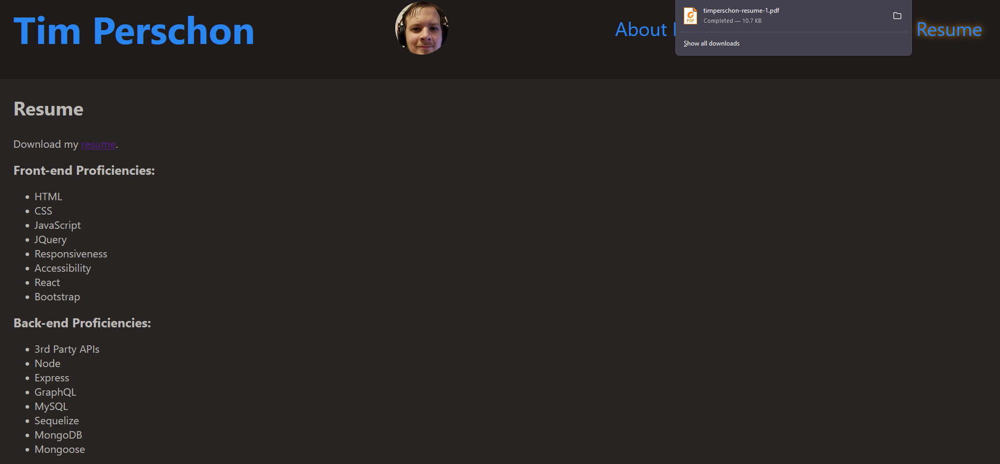

[](https://opensource.org/licenses/MIT)
# Table of Contents

[Description](#Description)

[Usage](#Usage)

[Links](#Links)

[Questions](#Questions)


# Description
```
Source code for my portfolio.
```
- Uses React to allow a 1-page view, rendering only subsections of the entire document when necessary
- Demonstrates knowledge of React, using components and other features
- Utilizes Font/Fort Awesome for icons
- Lacks a backend, so features are limited, but within scope of project
```
The first page you're taken to when visiting is the About Me. You'll see at the top the header and navigation bar, and the bottom the footer. These two elements persist through every page.
```

```
The footer has working links (utilizing icons) to different destinations that relate to me.
```

```
While each page clearly re-renders, you'll notice a corresponding change in the nav, a subtle highlight to show which page is being viewed.

The Portfolio page renders a list of projects I've worked on. Each project is presented as a simple card, but additional context can be viewed by mousing over each project, such as the name and relevant links. The onMouseEnter and onMouseLeave events were used to achieve these effects.

Each project is populated via the Project component, being fed an imported array from portfolioItems.js, with each item being given as props.
```

```
The Contact page houses a form that one could presumably use to contact me via the site. Since this deployment lacks a backend, this will not actually function, but it at least showcases some verification for the form's fields via the onBlur event. 

The submit button will not work unless all inputs are filled. If an input gains and then loses focus, it will alert you that it needs to be filled. Additionally, the email address input has an extra verification requiring the entry to conform to a particular regex specification.
```

```
The Resume page features a simple list of proficiencies, both backend and frontend, as well as a download link for my resume.

The proficiencies are populated through a Proficiency component, being fed two arrays imported as one object with properties frontend and backend from proficiencies.js.
```


# Links
If you're seeing this, you're likely already familiar with my github, but just in case, [here's my GitHub](https://github.com/tperschon)

The deployed Portfolio can be found [here](https://tperschon.github.io/react-portfolio).

Feel free to [E-Mail](timperschon@gmail.com) me with any comments, questions, or advice.